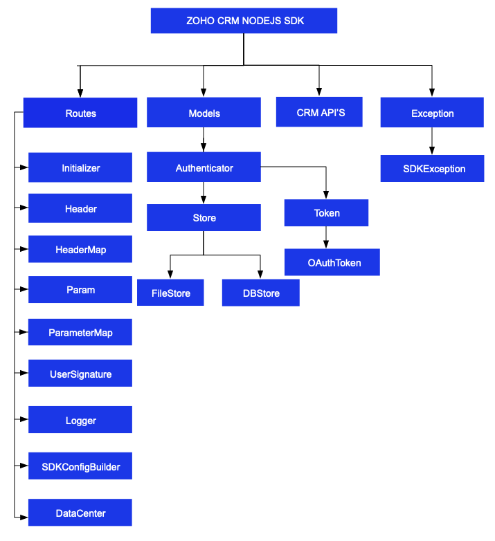

# ZOHO CRM NODEJS SDK - 2.1

## Table Of Contents

* [Overview](#overview)
* [Registering a Zoho Client](#registering-a-zoho-client)
* [Environmental Setup](#environmental-setup)
* [Including the SDK in your project](#including-the-sdk-in-your-project)
* [Persistence](#token-persistence)
  * [DataBase Persistence](#database-persistence)
  * [File Persistence](#file-persistence)
  * [Custom Persistence](#custom-persistence)
* [Configuration](#configuration)
* [Initialization](#initializing-the-application)
* [Class Hierarchy](#class-hierarchy)
* [Responses And Exceptions](#responses-and-exceptions)
* [Multi User Support](#multi-user-support-in-the-nodejs-sdk)
* [Sample Code](#sdk-sample-code)

## Overview

Zoho CRM NodeJS SDK offers a way to create client NodeJS applications that can be integrated with Zoho CRM.

## Registering a Zoho Client

Since Zoho CRM APIs are authenticated with OAuth2 standards, you should register your client app with Zoho. To register your app:

- Visit this page [https://api-console.zoho.com/](https://api-console.zoho.com)

- Click on `ADD CLIENT`.

- Choose a `Client Type`.

- Enter **Client Name**, **Client Domain** or **Homepage URL** and **Authorized Redirect URIs** then click `CREATE`.

- Your Client app would have been created and displayed by now.

- Select the created OAuth client.

- Generate grant token by providing the necessary scopes, time duration (the duration for which the generated token is valid) and Scope Description.

## Environmental Setup

NodeJS SDK is installable through **npm**. **npm** is a tool for dependency management in NodeJS. SDK expects the following from the client app.

- Client app must have Node(version 12 and above)

- NodeJS SDK must be installed into client app through **npm**.

## Including the SDK in your project

You can include the SDK to your project using:

- Install **Node** from [nodejs.org](https://nodejs.org/en/download/) (if not installed).

- Install **NodeJS SDK**
    - Navigate to the workspace of your client app.
    - Run the command below:

    ```sh
    npm install @zohocrm/nodejs-sdk
    ```
- The NodeJS SDK will be installed and a package named **@zohocrm/nodejs-sdk** will be created in the local machine.

- Another method to install the SDK
    - Add dependencies to the package.json of the node server with the latest version (recommended)
    - Run **npm install** in the directory which installs all the dependencies mentioned in package.json.


## Token Persistence

Token persistence refers to storing and utilizing the authentication tokens that are provided by Zoho. There are three ways provided by the SDK in which persistence can be utilized. They are DataBase Persistence, File Persistence and Custom Persistence.

### Table of Contents

- [DataBase Persistence](#database-persistence)

- [File Persistence](#file-persistence)

- [Custom Persistence](#custom-persistence)

### Implementing OAuth Persistence

Once the application is authorized, OAuth access and refresh tokens can be used for subsequent user data requests to Zoho CRM. Hence, they need to be persisted by the client app.

The persistence is achieved by writing an implementation of the inbuilt **TokenStore interface**, which has the following callback methods.

- **getToken(user, token)** - invoked before firing a request to fetch the saved tokens. This method should return implementation **Token Class** object for the library to process it.

- **saveToken(user, token)** - invoked after fetching access and refresh tokens from Zoho.

- **deleteToken(token)** - invoked before saving the latest tokens.

- **getTokens()** - The method to retrieve all the stored tokens.

- **deleteTokens()** - The method to delete all the stored tokens.

- **getTokenById(id, token)** - This method is used to retrieve the user token details based on unique ID.

Note:

- id is a string.

- user is an instance of **UserSignature**.

- token is an instance of **Token** interface.

### DataBase Persistence

In case the user prefers to use default DataBase persistence, **MySQL** can be used.

- The database name should be **zohooauth**.

- There must be a table name **oauthtoken** with columns.

  - id varchar(255)

  - user_mail varchar(255)

  - client_id varchar(255)

  - client_secret varchar(255)

  - refresh_token varchar(255)

  - access_token varchar(255)

  - grant_token varchar(255)

  - expiry_time varchar(20)

  - redirect_url varchar(255)

Note:

  - Custom database name and table name can be set in DBStore instance


#### MySQL Query

```sql
CREATE TABLE oauthtoken (
  id varchar(255) NOT NULL,
  user_mail varchar(255) NOT NULL,
  client_id varchar(255),
  client_secret varchar(255),
  refresh_token varchar(255),
  access_token varchar(255),
  grant_token varchar(255),
  expiry_time varchar(20),
  redirect_url varchar(255),
  primary key (id)
);
```

#### Create DBStore object

```js
const DBBuilder = require( "@zohocrm/nodejs-sdk/models/authenticator/store/db_builder").DBBuilder;
/*
 * DBStore takes the following parameters
 * host -> DataBase host name. Default value "localhost"
 * databaseName -> DataBase name. Default  value "zohooauth"
 * userName -> DataBase user name. Default value "root"
 * password -> DataBase password. Default value ""
 * portNumber -> DataBase port number. Default value "3306"
 * tableName -> Table Name. Default value "oauthtoken"
*/

let tokenstore = new DBStore().build();

let tokenstore = new DBBuilder()
.host("hostName")
.databaseName("databaseName")
.userName("userName")
.portNumber("portNumber")
.tableName("tableName")
.password("password")
.build();
```

### File Persistence

In case of default File Persistence, the user can persist tokens in the local drive, by providing the the absolute file path to the FileStore object. The File contains the following

- The File contains

  - id

  - user_mail

  - client_id

  - client_secret

  - refresh_token

  - access_token

  - grant_token

  - expiry_time

  - redirect_url

#### Create FileStore object

```js
const FileStore = require( "@zohocrm/nodejs-sdk/models/authenticator/store/file_store").FileStore;
/*
 * FileStore takes the following parameter
 * 1 -> Absolute file path of the file to persist tokens
*/
let tokenstore = new FileStore("/Users/username/Documents/nodejs_sdk_tokens.txt");
```

### Custom Persistence

To use Custom Persistence, the user must extend **[TokenStore Class](models/authenticator/store/token_store.js)** and override the methods.

```js
const TokenStore = require('@zohocrm/nodejs-sdk/models/authenticator/store/token_store').TokenStore;

class CustomStore extends TokenStore{

    constructor(){
        super();
    }

    /**
     *
     * @param {UserSignature} user A UserSignature class instance.
     * @param {Token} token A Token (@zohocrm/nodejs-sdk/models/authenticator/oauth_token) class instance.
     * @returns A Token class instance representing the user token details.
     * @throws {SDKException} if any error occurs.
     */
    getToken(user, token) {
        // Add code to get the token
        return null;
    }

    /**
     *
     * @param {UserSignature} user A UserSignature class instance.
     * @param {Token} token A Token (@zohocrm/nodejs-sdk/models/authenticator/oauth_token) class instance.
     * @throws {SDKException} if any error occurs.
     */
    saveToken(user, token) {
        // Add code to save the token
    }

    /**
     *
     * @param {Token} token A Token (@zohocrm/nodejs-sdk/models/authenticator/oauth_token) class instance.
     * @throws {SDKException} if any error occurs.
     */
    deleteToken(token) {
        // Add code to delete the token
    }

    /**
     * @returns {Array} - An array of Token class instances
     * @throws {SDKException}
     */
    getTokens() {
        //Add code to retrieve all the stored tokens.
    }

    /**
     * @throws {SDKException}
     */
    deleteTokens() {
        //Add code to delete all the stored tokens.
    }

    /**
      * @param {String} id A string.
      * @param {Token} token A Token (com\zoho\api\authenticator\OAuthToken) class instance.
      * @return {Token} A Token class instance representing the user token details.
      * @throws {SDKException} if any problem occurs.
    */
    getTokenById(id, token) {
      // Add code to get the token using unique id
      return null;
    }
}

module.exports = {CustomStore}
```

## Configuration

Before you get started with creating your NodeJS application, you need to register your client and authenticate the app with Zoho.

- Create an instance of **Logger** Class to log exception and API information.

    ```js
    const {Levels} = require("@zohocrm/nodejs-sdk/routes/logger/logger");
    const LogBuilder = require("@zohocrm/nodejs-sdk/routes/logger/log_builder").LogBuilder;
    /*
    * Create an instance of Logger Class that requires the following
    * level -> Level of the log messages to be logged. Can be configured by typing Levels "." and choose any level from the list displayed.
    * filePath -> Absolute file path, where messages need to be logged.
    */
    let logger = new LogBuilder()
        .level(Levels.INFO)
        .filePath("/Users/Documents/final-logs.txt")
        .build();
    ```

- Create an instance of **UserSignature** Class that identifies the current user.

    ```js
    const UserSignature = require( "@zohocrm/nodejs-sdk/routes/user_signature").UserSignature;
    //Create an UserSignature instance that takes user Email as parameter
    let user = new UserSignature("abc@zoho.com");
    ```

- Configure API environment which decides the domain and the URL to make API calls.

    ```js
    const USDataCenter = require( "@zohocrm/nodejs-sdk/routes/dc/us_data_center").USDataCenter;
    /*
     * Configure the environment
     * which is of the pattern Domain.Environment
     * Available Domains: USDataCenter, EUDataCenter, INDataCenter, CNDataCenter, AUDataCenter
     * Available Environments: PRODUCTION(), DEVELOPER(), SANDBOX()
    */
    let environment = USDataCenter.PRODUCTION();
    ```

- Create an instance of **[OAuthToken](models/authenticator/oauth_token.js)** with the information that you get after registering your Zoho client.

    ```js
    const OAuthBuilder = require("@zohocrm/nodejs-sdk/models/authenticator/oauth_builder").OAuthBuilder;

    /*
    * Create a Token instance that requires the following
    * clientId -> OAuth client id.
    * clientSecret -> OAuth client secret.
    * refreshToken -> REFRESH token.
    * grantToken -> GRANT token.
    * id -> User unique id.
    * redirectURL -> OAuth redirect URL.
    */
    //Create a Token instance
    // if refresh token is available
    // The SDK throws an exception, if the given id is invalid.
    let token = new OAuthBuilder()
    .id("id")
    .build();

    // if grant token is available
    let token = new OAuthBuilder()
    .clientId("clientId")
    .clientSecret("clientSecret")
    .grantToken("grantToken")
    .redirectURL("redirectURL")
    .build();

    // if ID (obtained from persistence) is available
    let token = new OAuthBuilder()
    .clientId("clientId")
    .clientSecret("clientSecret")
    .refreshToken("refreshToken")
    .redirectURL("redirectURL")
    .build();
    ```

- Create an instance of **TokenStore** to persist tokens, used for authenticating all the requests.

    ```js
    const DBBuilder = require( "@zohocrm/nodejs-sdk/models/authenticator/store/db_builder").DBBuilder;

    /*
    * Create an instance of DBStore that requires the following
    * host -> DataBase host name. Default value "localhost"
    * databaseName -> DataBase name. Default  value "zohooauth"
    * userName -> DataBase user name. Default value "root"
    * password -> DataBase password. Default value ""
    * portNumber -> DataBase port number. Default value "3306"
    * tabletName -> DataBase table name. Default value "oauthtoken"
    */

    let tokenstore = new DBStore().build();

    let tokenstore = new DBBuilder()
        .host("hostName")
        .databaseName("databaseName")
        .userName("userName")
        .portNumber("portNumber")
        .tableName("tableName")
        .password("password")
        .build();

    let tokenstore = new FileStore("absolute_file_path");

    let tokenstore = new CustomStore();
    ```

- Create an instance of **SDKConfig** containing the SDK configuration.

    ```js
    const SDKConfigBuilder = require("@zohocrm/nodejs-sdk/routes/sdk_config_builder").SDKConfigBuilder;

    /*
     * autoRefreshFields
     * if true - all the modules' fields will be auto-refreshed in the background, every hour.
     * if false - the fields will not be auto-refreshed in the background. The user can manually delete the file(s) or refresh the fields using methods from ModuleFieldsHandler(utils/util/module_fields_handler.js)
     *
     * pickListValidation
     * A boolean field that validates user input for a pick list field and allows or disallows the addition of a new value to the list.
     * if true - the SDK validates the input. If the value does not exist in the pick list, the SDK throws an error.
     * if false - the SDK does not validate the input and makes the API request with the user’s input to the pick list
     */
    let sdkConfig = new SDKConfigBuilder().pickListValidation(false).autoRefreshFields(true).build();
    ```

- The path containing the absolute directory path (in the key resourcePath) to store user-specific files containing information about fields in modules.

    ```js
    let resourcePath = "/Users/user_name/Documents/nodejs-app";
    ```

- Create an instance of [RequestProxy](routes/request_proxy.js) containing the proxy properties of the user.

    ```js
    const RequestProxy = require( "@zohocrm/nodejs-sdk/routes/request_proxy").RequestProxy;

    /*
     * RequestProxy class takes the following parameters
     * host -> Host
     * port -> Port Number
     * user -> User Name. Default null.
     * password -> Password. Default null
     */
    let requestProxy = new ProxyBuilder()
     .host("proxyHost")
     .port("proxyPort")
     .user("proxyUser")
     .password("password")
     .build();
    ```

## Initializing the Application

Initialize the SDK using the following code.

```js
const InitializeBuilder = require( "@zohocrm/nodejs-sdk/routes/initialize_builder").InitializeBuilder;
const OAuthBuilder = require( "@zohocrm/nodejs-sdk/models/authenticator/oauth_builder").OAuthBuilder;
const UserSignature = require( "@zohocrm/nodejs-sdk/routes/user_signature").UserSignature;
const {Levels} = require( "@zohocrm/nodejs-sdk/routes/logger/logger");
const LogBuilder = require( "@zohocrm/nodejs-sdk/routes/logger/log_builder").LogBuilder;
const USDataCenter = require( "@zohocrm/nodejs-sdk/routes/dc/us_data_center").USDataCenter;
const DBBuilder = require( "@zohocrm/nodejs-sdk/models/authenticator/store/db_builder").DBBuilder;
const FileStore = require( "@zohocrm/nodejs-sdk/models/authenticator/store/file_store").FileStore;
const SDKConfigBuilder = require("@zohocrm/nodejs-sdk/routes/sdk_config_builder").SDKConfigBuilder;
const ProxyBuilder = require( "@zohocrm/nodejs-sdk/routes/proxy_builder").ProxyBuilder;


class Initializer {

    static async initialize() {
       /*
        * Create an instance of Logger Class that requires the following
        * level -> Level of the log messages to be logged. Can be configured by typing Levels "." and choose any level from the list displayed.
        * filePath -> Absolute file path, where messages need to be logged.
        */
        let logger = new LogBuilder()
        .level(Levels.INFO)
        .filePath("/Users/user_name/Documents/nodejs_sdk_log.log")
        .build();
        /*
         * Create an UserSignature instance that takes user Email as parameter
         */
        let user = new UserSignature("abc@zoho.com");

        /*
		 * Configure the environment
		 * which is of the pattern Domain.Environment
		 * Available Domains: USDataCenter, EUDataCenter, INDataCenter, CNDataCenter, AUDataCenter
		 * Available Environments: PRODUCTION(), DEVELOPER(), SANDBOX()
		 */
        let environment = USDataCenter.PRODUCTION();

        /*
		 * Create a Token instance
		 * clientId -> OAuth client id.
		 * clientSecret -> OAuth client secret.
		 * grantToken -> GRANT token.
         * redirectURL -> OAuth redirect URL. Default value is null
		 */
        let token = new OAuthBuilder()
        .clientId("clientId")
        .clientSecret("clientSecret")
        .grantToken("GRANT Token")
        .redirectURL("redirectURL")
        .build();

        /*
        * TokenStore can be any of the following
        * DB Persistence - Create an instance of DBStore
        * File Persistence - Create an instance of FileStore
        * Custom Persistence - Create an instance of CustomStore
        */

        /*
		* Create an instance of DBStore.
		 * host -> DataBase host name. Default "localhost"
		 * databaseName -> DataBase name. Default "zohooauth"
		 * userName -> DataBase user name. Default "root"
		 * password -> DataBase password. Default ""
		 * portNumber -> DataBase port number. Default "3306"
         * tableName -> DataBase table name. Default value "oauthtoken"
		*/

        // let tokenstore = new DBBuilder().build();

        let tokenstore = new DBBuilder()
            .host("hostName")
            .databaseName("databaseName")
            .userName("userName")
            .portNumber("portNumber")
            .tableName("tableName")
            .password("password")
            .build();
        /*
		 * Create an instance of FileStore that takes absolute file path as parameter
		 */
        // let tokenstore = new FileStore("/Users/username/Documents/nodejs_sdk_tokens.txt");

        // let tokenstore = new CustomStore();

        /*
     	 * autoRefreshFields
         * if true - all the modules' fields will be auto-refreshed in the background, every hour.
     	 * if false - the fields will not be auto-refreshed in the background. The user can manually delete the file(s) or refresh the fields using methods from ModuleFieldsHandler(utils/util/module_fields_handler.js)
     	 *
     	 * pickListValidation
         * A boolean field that validates user input for a pick list field and allows or disallows the addition of a new value to the list.
         * if true - the SDK validates the input. If the value does not exist in the pick list, the SDK throws an error.
         * if false - the SDK does not validate the input and makes the API request with the user’s input to the pick list
     	*/
    	let sdkConfig = new SDKConfigBuilder().pickListValidation(false).autoRefreshFields(true).build();

        /*
         * The path containing the absolute directory path to store user specific JSON files containing module fields information.
         */
        let resourcePath = "/Users/user_name/Documents/nodejssdk-application";

        /*
		 * Create an instance of RequestProxy class that takes the following parameters
		 * host -> Host
		 * port -> Port Number
		 * user -> User Name
		 * password -> Password
		 */
        let requestProxy = new ProxyBuilder()
            .host("proxyHost")
            .port("proxyPort")
            .user("proxyUser")
            .password("password")
            .build();

        /*
         * Set the following in InitializeBuilder
         * user -> UserSignature instance
         * environment -> Environment instance
         * token -> Token instance
         * store -> TokenStore instance
         * SDKConfig -> SDKConfig instance
         * resourcePath -> resourcePath
         * logger -> Logger instance. Default value is null
         * requestProxy -> RequestProxy instance. Default value is null
         */
        // The SDK can be initialized by any of the following methods
       (await new InitializeBuilder())
        .user(user)
        .environment(environment)
        .token(token)
        .store(tokenstore)
        .SDKConfig(sdkConfig)
        .resourcePath(resourcePath)
        .logger(logger)
        .requestProxy(requestProxy)
        .initialize();
    }
}

Initializer.initialize()
```

- You can now access the functionalities of the SDK. Refer to the sample codes to make various API calls through the SDK.

## Class Hierarchy



## Responses and Exceptions

All SDK method calls return an instance of **[APIResponse](routes/controllers/api_response.js)**.

After a successful API request, the **getObject()** method returns an instance of the ResponseWrapper (for **GET**) or the ActionWrapper (for **POST, PUT, DELETE**).

Whenever the API returns an error response, the **getObject()** returns an instance of **APIException** class.

**ResponseWrapper** (for **GET** requests) and ActionWrapper (for **POST, PUT, DELETE** requests) are the expected objects for Zoho CRM APIs’ responses

However, some specific operations have different expected objects, such as the following

- Operations involving records in Tags
    - **RecordActionWrapper**

- Getting Record Count for a specific Tag operation
    - **CountWrapper**

- Operations involving BaseCurrency
    - **BaseCurrencyActionWrapper**

- Lead convert operation
    - **ConvertActionWrapper**

- Retrieving Deleted records operation
    - **DeletedRecordsWrapper**

- Record image download operation
    - **FileBodyWrapper**

- MassUpdate record operations
    - **MassUpdateActionWrapper**
    - **MassUpdateResponseWrapper**

- For Transfer Pipeline operation
  - **APIResponse&lt;TransferActionHandler&gt;**

### GET Requests

- The **getObject()** returns instance of one of the following classes, based on the return type.
    - For  **application/json** responses
        - **ResponseWrapper**
        - **CountWrapper**
        - **DeletedRecordsWrapper**
        - **MassUpdateResponseWrapper**
        - **APIException**

    - For **file download** responses
        - **FileBodyWrapper**
        - **APIException**

### POST, PUT, DELETE Requests

- The **getObject()** returns instance of one of the following classes
    - **ActionWrapper**
    - **RecordActionWrapper**
    - **BaseCurrencyActionWrapper**
    - **MassUpdateActionWrapper**
    - **ConvertActionWrapper**
    - **APIException**
    - **TransferActionWrapper**

- These wrapper classes may contain one or an array of instances of the following classes, depending on the response
    - **SuccessResponse Class**, if the request was successful.
    - **APIException Class**, if the request was erroneous.

For example, when you insert two records, and one of them was inserted successfully while the other one failed, the ActionWrapper will contain one instance each of the SuccessResponse and APIException classes.

All other exceptions such as SDK anomalies and other unexpected behaviours are thrown under the **[SDKException](core/com/zoho/crm/api/exception/sdk_exception.js)** class.

## Multi-User support in the NodeJS SDK

The **NodeJS SDK** (version 2.x.x) supports both single-user and multi-user app.

### Multi-user App

Multi-users functionality is achieved using **switchUser()** method.

```js
//If proxy needs to be configured for the User
(await new InitializeBuilder())
    .user(user)
    .environment(environment)
    .token(token)
    .store(tokenstore)
    .SDKConfig(sdkConfig)
    .switchUser();
```

To Remove a user's configuration in SDK. Use the below code
```js
await Initializer.removeUserConfiguration(user, environment)
```

### Sample Multi-user code

```js
const InitializeBuilder = require( "@zohocrm/nodejs-sdk/routes/initialize_builder").InitializeBuilder;
const OAuthBuilder = require( "@zohocrm/nodejs-sdk/models/authenticator/oauth_builder").OAuthBuilder;
const UserSignature = require( "@zohocrm/nodejs-sdk/routes/user_signature").UserSignature;
const {Levels} = require( "@zohocrm/nodejs-sdk/routes/logger/logger");
const LogBuilder = require( "@zohocrm/nodejs-sdk/routes/logger/log_builder").LogBuilder;
const USDataCenter = require( "@zohocrm/nodejs-sdk/routes/dc/us_data_center").USDataCenter;
const EUDataCenter = require( "@zohocrm/nodejs-sdk/routes/dc/eu_data_center").EUDataCenter;
const DBBuilder = require( "@zohocrm/nodejs-sdk/models/authenticator/store/db_builder").DBBuilder;
const FileStore = require( "@zohocrm/nodejs-sdk/models/authenticator/store/file_store").FileStore;
const {RecordOperations} = require("@zohocrm/nodejs-sdk/core/com/zoho/crm/api/record/record_operations");
const ParameterMap = require("@zohocrm/nodejs-sdk/routes/parameter_map").ParameterMap;
const HeaderMap = require("@zohocrm/nodejs-sdk/routes/header_map").HeaderMap;
const ResponseWrapper = require("@zohocrm/nodejs-sdk/core/com/zoho/crm/api/record/response_wrapper").ResponseWrapper;
const ProxyBuilder = require( "@zohocrm/nodejs-sdk/routes/proxy_builder").ProxyBuilder;
const SDKConfigBuilder = require("@zohocrm/nodejs-sdk/routes/sdk_config_builder").MasterModel;
const GetRecordsParam = require("@zohocrm/nodejs-sdk/core/com/zoho/crm/api/record/record_operations").GetRecordsParam;
const GetRecordsHeader = require("@zohocrm/nodejs-sdk/core/com/zoho/crm/api/record/record_operations").GetRecordsHeader;

class Record {

    static async call() {
        /*
		 * Create an instance of Logger Class that takes two parameters
		 * 1 -> Level of the log messages to be logged. Can be configured by typing Levels "." and choose any level from the list displayed.
		 * 2 -> Absolute file path, where messages need to be logged.
		 */
        let logger = new LogBuilder()
        .level(Levels.INFO)
        .filePath("/Users/username/final-logs.txt")
        .build();

        /*
         * Create an UserSignature instance that takes user Email as parameter
         */
        let user1 = new UserSignature("abc@zoho.com");

        /*
		 * Configure the environment
		 * which is of the pattern Domain.Environment
		 * Available Domains: USDataCenter, EUDataCenter, INDataCenter, CNDataCenter, AUDataCenter
		 * Available Environments: PRODUCTION(), DEVELOPER(), SANDBOX()
		 */
        let environment1 = USDataCenter.PRODUCTION();

        /*
		 * Create a Token instance
		 * clientId -> OAuth client id.
		 * clientSecret -> OAuth client secret.
         * refreshToken -> GRANT token.
		 * refreshToken -> REFRESH token.
         * redirectURL -> OAuth redirect URL. Default value is null
		 */
        let token1 = new OAuthBuilder()
        .clientId("clientId")
        .clientSecret("clientSecret")
        // .grantToken("grantToken")
        .refreshToken("refreshToken")
        .redirectURL("redirectURL")
        .build();

        /*
		 * Create an instance of TokenStore.
		 * host -> DataBase host name. Default "localhost"
		 * databaseName -> DataBase name. Default "zohooauth"
		 * userName -> DataBase user name. Default "root"
		 * password -> DataBase password. Default ""
		 * portNumber -> DataBase port number. Default "3306"
         * tableName -> DataBase table name. Default value "oauthtoken"
		 */
        let tokenstore = new DBStore().build();

        let tokenstore = new DBBuilder()
            .host("hostName")
            .databaseName("databaseName")
            .userName("userName")
            .portNumber("portNumber")
            .tableName("tableName")
            .password("password")
            .build();

        /*
		 * Create an instance of FileStore that takes absolute file path as parameter
		*/
        let tokenstore = new FileStore("/Users/username/nodejs_sdk_tokens.txt");

        /*
        * autoRefreshFields
        * if true - all the modules' fields will be auto-refreshed in the background, every hour.
        * if false - the fields will not be auto-refreshed in the background. The user can manually delete the file(s) or refresh the fields using methods from ModuleFieldsHandler(utils/util/module_fields_handler.js)
        *
        * pickListValidation
        * A boolean field that validates user input for a pick list field and allows or disallows the addition of a new value to the list.
        * True - the SDK validates the input. If the value does not exist in the pick list, the SDK throws an error.
        * False - the SDK does not validate the input and makes the API request with the user’s input to the pick list
        */
        let sdkConfig = new SDKConfigBuilder().pickListValidation(false).autoRefreshFields(true).build();

        /*
         * The path containing the absolute directory path to store user specific JSON files containing module fields information.
         */
        let resourcePath = "/Users/username";

        /*
         * Call the static initialize method of Initializer class that takes the following arguments
         * 1 -> UserSignature instance
         * 2 -> Environment instance
         * 3 -> Token instance
         * 4 -> TokenStore instance
         * 5 -> SDKConfig instance
         * 6 -> resourcePath
         * 7 -> Logger instance. Default value is null
         * 8 -> RequestProxy instance. Default value is null
         */
        (await new InitializeBuilder())
        .user(user1)
        .environment(environment1)
        .token(token1)
        .store(tokenstore)
        .SDKConfig(sdkConfig)
        .resourcePath(resourcePath)
        .logger(logger)
        .initialize();

        await Record.getRecords("Leads");

        await Initializer.removeUserConfiguration(user1, environment1);

        let user2 = new UserSignature("abc2@zoho.eu");

        let environment2 = EUDataCenter.SANDBOX();

        let token2 = new OAuthBuilder()
        .clientId("clientId")
        .clientSecret("clientSecret")
        .grantToken("GRANT Token")
        .refreshToken("REFRESH Token")
        .redirectURL("redirectURL")
        .build();

        let requestProxy = new ProxyBuilder()
            .host("proxyHost")
            .port("proxyPort")
            .user("proxyUser")
            .password("password")
            .build();

        let sdkConfig2 = new SDKConfigBuilder().pickListValidation(true).autoRefreshFields(true).build();

        (await new InitializeBuilder())
        .user(user2)
        .environment(environment2)
        .token(token2)
        .SDKConfig(sdkConfig2)
        .requestProxy(requestProxy)
        .switchUser();

        await Record.getRecords("Leads");
    }

    static async getRecords(moduleAPIName){
        try {

            //Get instance of RecordOperations Class
            let recordOperations = new RecordOperations();

            let paramInstance = new ParameterMap();

            await paramInstance.add(GetRecordsParam.APPROVED, "both");

            let headerInstance = new HeaderMap();

            await headerInstance.add(GetRecordsHeader.IF_MODIFIED_SINCE, new Date("2020-01-01T00:00:00+05:30"));

            //Call getRecords method that takes paramInstance, headerInstance and moduleAPIName as parameters
            let response = await recordOperations.getRecords(moduleAPIName, paramInstance, headerInstance);

            if(response != null){

                //Get the status code from response
                console.log("Status Code: " + response.getStatusCode());

                if([204, 304].includes(response.getStatusCode())){
                    console.log(response.getStatusCode() == 204? "No Content" : "Not Modified");

                    return;
                }

                //Get the object from response
                let responseObject = response.getObject();

                if(responseObject != null){

                    //Check if expected ResponseWrapper instance is received
                    if(responseObject instanceof ResponseWrapper){

                        //Get the array of obtained Record instances
                        let records = responseObject.getData();

                        for (let index = 0; index < records.length; index++) {
                            let record = records[index];

                            //Get the ID of each Record
                            console.log("Record ID: " + record.getId());

                            //Get the createdBy User instance of each Record
                            let createdBy = record.getCreatedBy();

                            //Check if createdBy is not null
                            if(createdBy != null){
                                //Get the ID of the createdBy User
                                console.log("Record Created By User-ID: " + createdBy.getId());

                                //Get the name of the createdBy User
                                console.log("Record Created By User-Name: " + createdBy.getName());

                                //Get the Email of the createdBy User
                                console.log("Record Created By User-Email: " + createdBy.getEmail());
                            }

                            //Get the CreatedTime of each Record
                            console.log("Record CreatedTime: " + record.getCreatedTime());

                            //Get the modifiedBy User instance of each Record
                            let modifiedBy = record.getModifiedBy();

                            //Check if modifiedBy is not null
                            if(modifiedBy != null){
                                //Get the ID of the modifiedBy User
                                console.log("Record Modified By User-ID: " + modifiedBy.getId());

                                //Get the name of the modifiedBy User
                                console.log("Record Modified By User-Name: " + modifiedBy.getName());

                                //Get the Email of the modifiedBy User
                                console.log("Record Modified By User-Email: " + modifiedBy.getEmail());
                            }

                            //Get the ModifiedTime of each Record
                            console.log("Record ModifiedTime: " + record.getModifiedTime());

                            //Get the list of Tag instance each Record
                            let tags = record.getTag();

                            //Check if tags is not null
                            if(tags != null){
                                tags.forEach(tag => {
                                    //Get the Name of each Tag
                                    console.log("Record Tag Name: " + tag.getName());

                                    //Get the Id of each Tag
                                    console.log("Record Tag ID: " + tag.getId());

                                });
                            }

                            //Get all the values
                            let keyValues = record.getKeyValues();

                            let keyArray = Array.from(keyValues.keys());

                            for (let keyIndex = 0; keyIndex < keyArray.length; keyIndex++) {
                                const keyName = keyArray[keyIndex];

                                let value = keyValues.get(keyName);

                                console.log(keyName + " : " + value);
                            }
                        }
                    }
                }
            }
        } catch (error) {
            console.log(error);
        }
    }
}

Record.call();
```

- The program execution starts from call().

- The details of **"user1"** are is given in the variables user1, token1, environment1.

- Similarly, the details of another user **"user2"** is given in the variables user2, token2, environment2.

- The **switchUser()** function is used to switch between the **"user1"** and **"user2"** as required.

- Based on the latest switched user, the **Record.getRecords(moduleAPIName)** will fetch records.

## SDK Sample code

```js
const InitializeBuilder = require( "@zohocrm/nodejs-sdk/routes/initialize_builder").InitializeBuilder;
const OAuthBuilder = require( "@zohocrm/nodejs-sdk/models/authenticator/oauth_builder").OAuthBuilder;
const UserSignature = require( "@zohocrm/nodejs-sdk/routes/user_signature").UserSignature;
const {Levels} = require( "@zohocrm/nodejs-sdk/routes/logger/logger");
const LogBuilder = require( "@zohocrm/nodejs-sdk/routes/logger/log_builder").LogBuilder;
const USDataCenter = require( "@zohocrm/nodejs-sdk/routes/dc/us_data_center").USDataCenter;
const EUDataCenter = require( "@zohocrm/nodejs-sdk/routes/dc/eu_data_center").EUDataCenter;
const DBBuilder = require( "@zohocrm/nodejs-sdk/models/authenticator/store/db_builder").DBBuilder;
const FileStore = require( "@zohocrm/nodejs-sdk/models/authenticator/store/file_store").FileStore;
const {RecordOperations} = require("@zohocrm/nodejs-sdk/core/com/zoho/crm/api/record/record_operations");
const ParameterMap = require("@zohocrm/nodejs-sdk/routes/parameter_map").ParameterMap;
const HeaderMap = require("@zohocrm/nodejs-sdk/routes/header_map").HeaderMap;
const ResponseWrapper = require("@zohocrm/nodejs-sdk/core/com/zoho/crm/api/record/response_wrapper").ResponseWrapper;
const ProxyBuilder = require( "@zohocrm/nodejs-sdk/routes/proxy_builder").ProxyBuilder;
const SDKConfigBuilder = require("@zohocrm/nodejs-sdk/routes/sdk_config_builder").MasterModel;

class Record{

    static async getRecords(){

        /*
		 * Create an instance of Logger Class that requires the following
		 * level -> Level of the log messages to be logged. Can be configured by typing Levels "." and choose any level from the list displayed.
		 * filePath -> Absolute file path, where messages need to be logged.
		 */
        let logger = new LogBuilder()
        .level(Levels.INFO)
        .filePath("/Users/user_name/nodejs_sdk_log.log")
        .build();

        /*
         * Create an UserSignature instance that takes user Email as parameter
         */
        let user = new UserSignature("abc@zoho.com");

        /*
		 * Configure the environment
		 * which is of the pattern Domain.Environment
		 * Available Domains: USDataCenter, EUDataCenter, INDataCenter, CNDataCenter, AUDataCenter
		 * Available Environments: PRODUCTION(), DEVELOPER(), SANDBOX()
		 */
        let environment = USDataCenter.PRODUCTION();

        /*
		 * Create a Token instance
		 * clientId -> OAuth client id.
		 * clientSecret -> OAuth client secret.
         * grantToken -> GRANT token.
         * redirectURL -> OAuth redirect URL. Default value is null
		 */
        let token1 = new OAuthBuilder()
        .clientId("clientId")
        .clientSecret("clientSecret")
        .grantToken("GRANT Token")
        .redirectURL("redirectURL")
        .build();

        /*
		 * Create an instance of TokenStore.
		 * host -> DataBase host name. Default "localhost"
		 * databaseName -> DataBase name. Default "zohooauth"
		 * userName -> DataBase user name. Default "root"
		 * password -> DataBase password. Default ""
		 * portNumber -> DataBase port number. Default "3306"
         * tableName -> DataBase table name. Default value "oauthtoken"
		 */
        let tokenstore = new DBStore().build();

        let tokenstore = new DBBuilder()
            .host("hostName")
            .databaseName("databaseName")
            .userName("userName")
            .portNumber("portNumber")
            .tableName("tableName")
            .password("password")
            .build();

        /*
		 * Create an instance of FileStore that takes absolute file path as parameter
		 */
        let tokenstore = new FileStore("/Users/username/Documents/nodejs_sdk_tokens.txt");

        /*
        * autoRefreshFields
        * if true - all the modules' fields will be auto-refreshed in the background, every hour.
        * if false - the fields will not be auto-refreshed in the background. The user can manually delete the file(s) or refresh the fields using methods from ModuleFieldsHandler(utils/util/module_fields_handler.js)
        *
        * pickListValidation
        * A boolean field that validates user input for a pick list field and allows or disallows the addition of a new value to the list.
        * True - the SDK validates the input. If the value does not exist in the pick list, the SDK throws an error.
        * False - the SDK does not validate the input and makes the API request with the user’s input to the pick list
        */
        let sdkConfig = new SDKConfigBuilder().pickListValidation(false).autoRefreshFields(true).build();

        /*
         * The path containing the absolute directory path to store user specific JSON files containing module fields information.
         */
        let resourcePath = "/Users/user_name/Documents/nodejs-app";

        /*
         * Set the following in InitializeBuilder
         * user -> UserSignature instance
         * environment -> Environment instance
         * token -> Token instance
         * store -> TokenStore instance
         * SDKConfig -> sdkConfig instance
         * resourcePath -> resourcePath
         * logger -> Logger instance
         */
        (await new InitializeBuilder())
        .user(user1)
        .environment(environment1)
        .token(token1)
        .store(tokenstore)
        .SDKConfig(sdkConfig)
        .resourcePath(resourcePath)
        .logger(logger)
        .initialize();

        try {
            let moduleAPIName = "Leads";

            //Get instance of RecordOperations Class
            let recordOperations = new RecordOperations();

            let paramInstance = new ParameterMap();

            await paramInstance.add(GetRecordsParam.APPROVED, "both");

            let headerInstance = new HeaderMap();

            await headerInstance.add(GetRecordsHeader.IF_MODIFIED_SINCE, new Date("2020-01-01T00:00:00+05:30"));

            //Call getRecords method that takes paramInstance, headerInstance and moduleAPIName as parameters
            let response = await recordOperations.getRecords(moduleAPIName, paramInstance, headerInstance);

            if(response != null){

                //Get the status code from response
                console.log("Status Code: " + response.getStatusCode());

                if([204, 304].includes(response.getStatusCode())){
                    console.log(response.getStatusCode() == 204? "No Content" : "Not Modified");

                    return;
                }

                //Get the object from response
                let responseObject = response.getObject();

                if(responseObject != null){

                    //Check if expected ResponseWrapper instance is received
                    if(responseObject instanceof ResponseWrapper){

                        //Get the array of obtained Record instances
                        let records = responseObject.getData();

                        for (let index = 0; index < records.length; index++) {
                            let record = records[index];

                            //Get the ID of each Record
                            console.log("Record ID: " + record.getId());

                            //Get the createdBy User instance of each Record
                            let createdBy = record.getCreatedBy();

                            //Check if createdBy is not null
                            if(createdBy != null){
                                //Get the ID of the createdBy User
                                console.log("Record Created By User-ID: " + createdBy.getId());

                                //Get the name of the createdBy User
                                console.log("Record Created By User-Name: " + createdBy.getName());

                                //Get the Email of the createdBy User
                                console.log("Record Created By User-Email: " + createdBy.getEmail());
                            }

                            //Get the CreatedTime of each Record
                            console.log("Record CreatedTime: " + record.getCreatedTime());

                            //Get the modifiedBy User instance of each Record
                            let modifiedBy = record.getModifiedBy();

                            //Check if modifiedBy is not null
                            if(modifiedBy != null){
                                //Get the ID of the modifiedBy User
                                console.log("Record Modified By User-ID: " + modifiedBy.getId());

                                //Get the name of the modifiedBy User
                                console.log("Record Modified By User-Name: " + modifiedBy.getName());

                                //Get the Email of the modifiedBy User
                                console.log("Record Modified By User-Email: " + modifiedBy.getEmail());
                            }

                            //Get the ModifiedTime of each Record
                            console.log("Record ModifiedTime: " + record.getModifiedTime());

                            //Get the list of Tag instance each Record
                            let tags = record.getTag();

                            //Check if tags is not null
                            if(tags != null){
                                tags.forEach(tag => {
                                    //Get the Name of each Tag
                                    console.log("Record Tag Name: " + tag.getName());

                                    //Get the Id of each Tag
                                    console.log("Record Tag ID: " + tag.getId());

                                });
                            }

                            //Get all the values
                            let keyValues = record.getKeyValues();

                            let keyArray = Array.from(keyValues.keys());

                            for (let keyIndex = 0; keyIndex < keyArray.length; keyIndex++) {
                                const keyName = keyArray[keyIndex];

                                let value = keyValues.get(keyName);

                                console.log(keyName + " : " + value);
                            }
                        }
                    }
                }
            }
        } catch (error) {
            console.log(error);
        }
    }
}

Record.getRecords();
```

